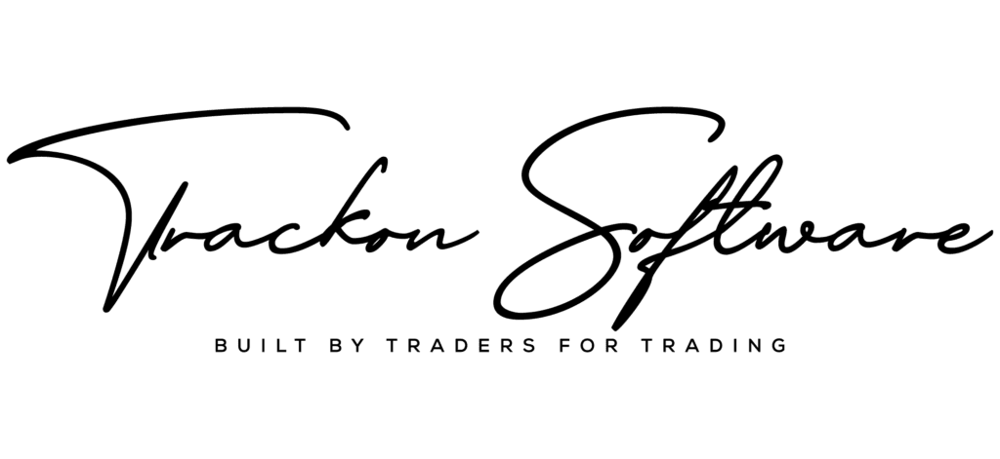

<!-- _class: lead -->

Five pages · September 2026

Every step has a name on it.

Five pages you can read on your phone. Where a trading house actually loses money, why the questions your team asked in the demo are the right ones, and what happens next.

Prepared for Mr Ayhan Yalcintas · Mr Fatih Ziya Akdogan and team

Murat Selim Ozturk · CEO, Trackon Software FZCO · Dubai

---

1 · Where Trackon began

# A logistics floor, a spreadsheet, and nobody's name

The logistics department of a grain trading house ran every cargo from Excel. Millions of tonnes a year. Vessels, documents, trucks, banks.

The work

Tasks had no order. Two people did the same job. Nobody did the next one.

The moment

When a cargo went wrong, every explanation ended the same way: <strong style="color: var(--red);">"It was not me."</strong> Nobody accepted an error, so nobody could prevent the next one.

What we did

We did not start by writing software. We sat on that floor and watched how a cargo really moved. The flow was already there. Nobody had written it down. We wrote it down as steps and gave every step a name.

Thirty years and five million tonnes a year later, every screen in Trackon still runs on that flow.

---

2 · The idea

# A step is a task with one owner, one deadline, one record

  
STEP 05 · LOGISTICSDONE

  
Shipping documents to bank

  

    

Owner

Documents specialist

    

Due

B/L date + 5 days

    

Completed

by name, date, time

    

Attached

B/L · invoice · COA · courier cost

  

<strong>Configured per department.</strong> Logistics, execution and finance each define their own steps: in sequence or in parallel, mandatory or optional. Your flow, not ours.

<strong>People organised by profession.</strong> Document steps go to the documents specialist, vessel steps to chartering, payment steps to treasury. Not to whoever is free.

<strong>The record is the accountability.</strong> Who did what, when, with which document and at what cost sits on the step. A cost entered on a step lands on that cargo's profit the same day, not at month end.

Contracts, shipments, documents, invoices, cash and P&amp;L sit on this one spine. Nothing is typed twice.

---

3 · What your team asked on 29 August

# You already found the steps that matter

Ten people, multimillion-dollar cargoes, and numbers that must be true in front of a bank or an investor. Three questions from the demo, and where each one lives in the system.

Emrah · storage cost over months

Bulk stock sitting for months carries its storage cost per lot, on the remaining quantity, refreshed as the lot is drawn down. It is a step with an owner, not a spreadsheet formula.

Fatih · claims arriving months after close

A late claim or invoice is entered on its shipment. It adjusts that cargo's result and the month it belongs to, and the record shows who entered it and when. Your three-month grace policy sits on top.

Ayhan · numbers for banks and investors

Every trader sees only their own counterparties. The monthly P&amp;L locks. There is no second version prepared for the bank, because every number is the sum of steps someone signed.

Index price feed and the operational budgeting module are part of your implementation, as agreed on the call.

---

<!-- _class: dark -->

4 · What you now know

# Contributions

1

A trading house rarely loses money on the trade. It loses it between desks, on steps nobody owns.

2

The flow already exists in your company. Writing it down as steps, one name on each, is the system.

3

For a company starting from zero, this is the advantage: nothing to migrate, nothing to unlearn. Approval flows, cost estimates and document steps are how the team works from the first cargo.

Every step has a name on it.

Next step
Your demo account. Mehmet sends the product list and the customer and vendor names, we configure it and open the WhatsApp support group. Three to five days with your own cargo, then we sit down on the agreement.

Murat Selim Ozturk · sozturk@trackon.com · trackon.com

